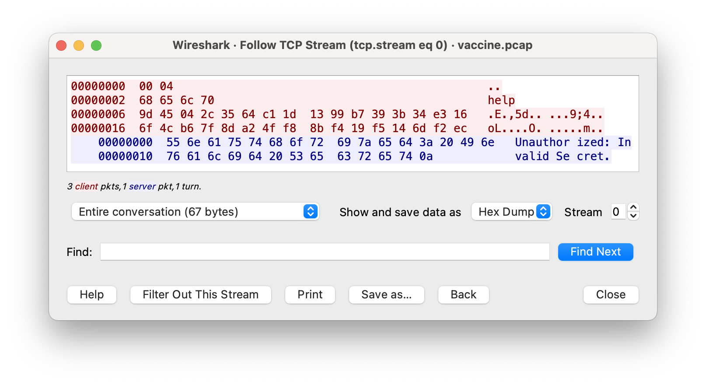

# hack_MAC Writeup

We are given a pcap file, an executable `vaccine_client` and also an address and port to connect to the vaccine server.
Apparently this client was used to interact with a vaccine database.

Upon inspection of the pcap file in Wireshark we can see several TCP streams from the client to the server.
Simply right click on a TCP message and select Follow > TCP Stream.

In stream 0 we observe the following:

Client:
```
00000000  00 04                                              ..
00000002  68 65 6c 70                                        help
00000006  9d 45 04 2c 35 64 c1 1d  13 99 b7 39 3b 34 e3 16   .E.,5d.. ...9;4..
00000016  6f 4c b6 7f 8d a2 4f f8  8b f4 19 f5 14 6d f2 ec   oL....O. .....m..
```

Server:
```
00000000  55 6e 61 75 74 68 6f 72  69 7a 65 64 3a 20 49 6e   Unauthor ized: In
00000010  76 61 6c 69 64 20 53 65  63 72 65 74 0a            valid Se cret.
```



So we can see that the client sent the command `help` along with some other protocol data, the `0x0004` before `help` and the `32` bytes after `help`.

Apparently the client sent the wrong secret with this message.

Okay let's look at another stream.
In Stream 2 we can see the following:

Client:
```
00000000  00 04                                              ..
00000002  68 65 6c 70                                        help
00000006  ca 48 52 94 35 a1 b5 72  f0 11 56 76 00 6a 19 cb   .HR.5..r ..Vv.j..
00000016  14 6f 68 3a 7d 77 75 ef  75 31 05 30 4c 36 e0 30   .oh:}wu. u1.0L6.0
```

Server:
```
00000000  0a 41 76 61 69 6c 61 62  6c 65 20 43 6f 6d 6d 61   .Availab le Comma
00000010  6e 64 73 3a 0a 68 65 6c  70 3a 20 20 20 20 20 20   nds:.hel p:      
00000020  20 20 20 20 20 20 20 20  20 20 20 20 20 44 69 73                 Dis
00000030  70 6c 61 79 20 74 68 69  73 20 6d 65 73 73 61 67   play thi s messag
00000040  65 0a 6c 69 73 74 5f 76  61 63 63 69 6e 65 73 3a   e.list_v accines:
00000050  20 20 20 20 20 20 20 20  20 20 4c 69 73 74 20 61              List a
00000060  6c 6c 20 76 61 63 63 69  6e 65 73 20 69 6e 20 74   ll vacci nes in t
00000070  68 65 20 64 61 74 61 62  61 73 65 0a 61 64 64 5f   he datab ase.add_
00000080  76 61 63 63 69 6e 65 20  3c 6e 61 6d 65 3e 3a 20   vaccine  <name>: 
00000090  20 20 20 20 41 64 64 20  61 20 76 61 63 63 69 6e       Add  a vaccin
000000A0  65 20 74 6f 20 74 68 65  20 64 61 74 61 62 61 73   e to the  databas
000000B0  65 0a 72 65 6d 6f 76 65  5f 76 61 63 63 69 6e 65   e.remove _vaccine
000000C0  20 3c 6e 61 6d 65 3e 3a  20 20 52 65 6d 6f 76 65    <name>:   Remove
000000D0  20 61 20 76 61 63 63 69  6e 65 20 66 72 6f 6d 20    a vacci ne from 
000000E0  74 68 65 20 64 61 74 61  62 61 73 65 0a 0a         the data base..
```

This time the correct secret was used. Upon inspection, the only thing that has changed in the clients message is the `32` bytes after the command `help`.
Therefore, we can safely assume that these bytes must somehow contain the `secret`.

It would be incorrect however to assume that those `32` bytes are the secret itself, as if we look a little further at some more TCP streams we can see that those bytes change depending on the command being sent.

Upon further inspection, we notice that the `2` bytes before the command actually contain the length of the command. For example when the `help` command was sent, the first `2` bytes are set to `0x0004`, for 4 bytes long.

Okay, so let's figure out how the secret is incorporated into the last 32 bytes of each message.
We can do this by investigating the client executable.

When we run the client without any arguments, it outputs the following:
```
Usage: ./vaccine_client host port secret command
```

So apparently we need to input the secret every time we would like to send a message to the server. Presumably this is because the client is going to be combining the secret somehow with our message in order to produce those last `32` bytes of the message.

Some thought into this, considering the fact that the 3rd segment of the message is exactly `256` bits long and the challenge's name is `hack_MAC`, would allow us to safely assume that those last `32` bytes are a [Message Authentication Code (MAC)](https://en.wikipedia.org/wiki/Message_authentication_code) which allows the server to be sure that we have the shared secret and are allowed to administer commands.

Fortunately for us, we have almost all of the ingredients required in order to conduct a [length extension](https://en.wikipedia.org/wiki/Length_extension_attack) attack which allows us to compute valid MACs and execute (somewhat) arbitrary commands on the server.
Those ingredients being:
* A vulnerable Merkle–Damgård based hash (SHA256 most likely in this case)
* A valid message and corresponding MAC
* The length of the secret (missing ingredient)

The only caveat is that the commands we execute must consist of previous commands that we know valid MACs for, plus a suffix.

For example, we would be able to execute `helpabcd` on the server, but not `this_is_some_new_random_command`. This is just a side effect of how length extension attacks work.

Even more fortunately for us, there exists a command on the server that is merely an extension of another command that we have a valid MAC for `get_vaccines_prototype` is an extension of the command `get_vaccines` via a suffix of `_prototype`.

Okay so all that's left to do for us now is conduct a length extension attack in order to run `get_vaccines_prototype` on the server.

The fact that we do not know the length of the secret is not much of an issue as this is something we can easily brute force for reasonable length secrets.

An easy way to go about this is via the use of [HashPump](https://github.com/bwall/HashPump) which was specifically designed for this attack.
HashPump comes with python bindings so we'll use those.

Firstly we need to be able to send a message to the server according to the protocol (`len(command) + command + MAC`).

```python
import asyncio

async def send_message(host: str, port: int, cmd: bytes, mac: bytes):
    reader, writer = await asyncio.open_connection(host, port)

    length = len(cmd).to_bytes(2, 'big')
    writer.write(length + cmd + mac)

    reply = await reader.readline()
    result = reply

    while reply:
        reply = await reader.readline()
        result += reply

    return result.decode()
```

Secondly we can conduct the attack by using hashpumpy and bruteforcing for the length of the shared secret.

```bash
pip install hashpumpy
```

```python
import hashpumpy
import binascii

# Obtained from pcap
LIST_VACCINE_MAC = 'c34746da6d8d5b1e9ec578a9dfa3e87aa4a09cc5e773674345a2db1c0b05cd03'

for i in range(1, 2**8):
    new_mac, new_cmd = hashpumpy.hashpump(LIST_VACCINE_MAC, 'list_vaccines',
                                          '_prototype', i)
    new_mac = binascii.unhexlify(new_mac)

    ret = asyncio.run(send_message('localhost', 1337, new_cmd, new_mac))

    if 'HACKMAC' in ret:
        print(i)
        print(ret)
        exit()
```

And we get our flag!

```
Vaccine(name='HACKMAC{y0u_r3411y_h4ck3d_7h47_m4c!}', experimental=True)
```
