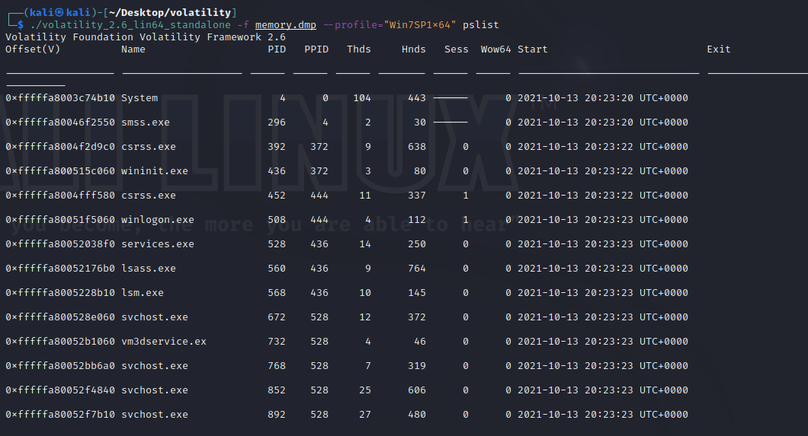
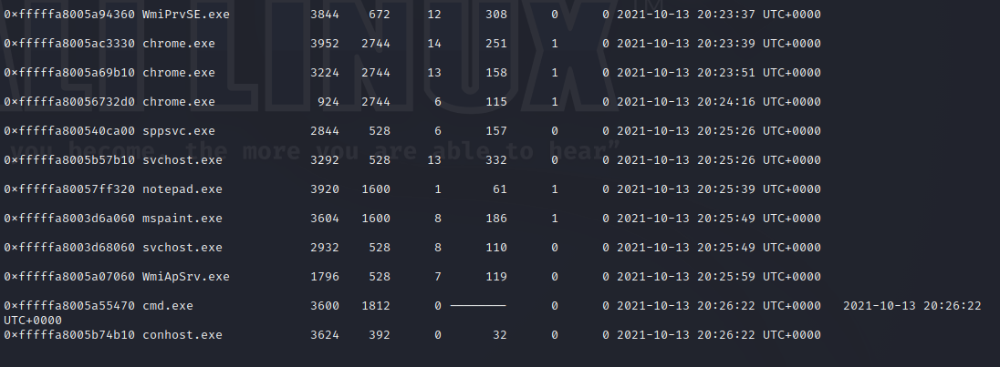

# Writeup - Lost but not forgotten
This challenge is a memory dump file that you will have to analyse using the Volatility tool. It also encorporates some other techniques that will be used to manipulate some files.

The flag is split up into four parts, which are scattered around different parts of the dump file.

When the file is initially downloaded, the command:

    volatility -f memory.dmp imageinfo

will help us identify the operating system where it came from. This will be useful as the "--profile" option will require this.

Afterwards,

    volatility -f memory.dmp --profile="Win7SP1x64" pslist

will list all running processes and programs during that time.

There are three processes that stand out, "chrome.exe", "paint.exe" and "notepad.exe".

First, let's take a look at "notepad.exe". There are multiple ways to extract the contents of the program, but we can use the "strings" and "grep" commands to look for text, even outside of the intended file. Before this, we need to dump "notepad.exe" out of the whole dump file using the process ID from before:

    volatility -f memory.dmp --profile="Win7SP1x64" -p 3920 memdump -D ./  

Once this is done, we can use the commands to see if any text or clues appear by using the string "HACKMAC".

    strings -e l ./3920.dmp | grep "HACKMAC" -B 10 -A 10

This will give us our main clues, and possibly the first piece of the flag. The to-do list points towards Chrome and Paint being the next pieces, but the "Find out my name" line can be discerned from earlier. To confirm that it is the computer name, we can run the following commands:

    volatility -f memory.dmp --profile="Win7SP1x64" hivelist

    volatility -f memory.dmp --profile="Win7SP1x64" printkey -o 0xfffff8a000024010 -K "ControlSet001\Control\ComputerName\ComputerName"

The first will list all system processes and registries currently running and the second will list the computer name. As we can see, we can confirm this, and we have the first piece of the flag.

Moving on to "paint.exe", we can use the same command from earlier to dump the process to make it easier to analyse:

    volatility -f memory.dmp --profile="Win7SP1x64" -p 3604 memdump -D ./

Once this is done, we can change the extension to a .data file and open it using a image editor that can support loading from raw data formats. In this case, I used GIMP to open the .data file. After a bit of messing around, an image can be found within the file, which brings the next piece of the flag and our next clue.

Luckily for us, Volatility has a simple command to show what's hidden in the clipboard.

    volatility -f memory.dmp --profile="Win7SP1x64" clipboard 

This gives us one more piece of the flag.

Lastly, we move on to Google Chrome. Extracting the files for this program will be a bit different. First, we mainly want to look at the history, to see if the user has anything to hide.

    volatility -f memory.dmp --profile="Win7SP1x64" filescan | grep -ie "history$"
    
    volatility -f memory.dmp --profile="Win7SP1x64" dumpfiles -Q 0x000000013e00e070 -D ./

The first command will show the memory address for the Chrome history file, while the second one will extract it.

Once we have the file, doing a bit of research will reveal that Chrome stores history data in a SQLite database. Renaming the .dat file and extension to .sqlite should make it work.

Using a DB browser for SQLite, looking through "keyword_search_terms" will reveal the history of the user, and most importantly, the last piece of the flag.

After all of this, the final flag should be:

> HACKMAC{5h4rK5_aR3_aP3X_pR3DaT0r5}

