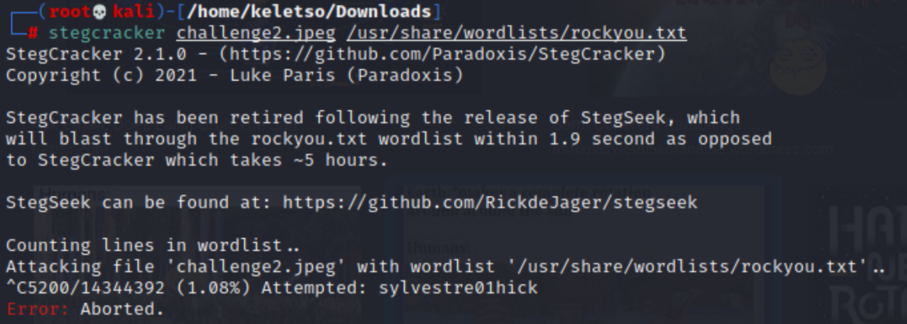
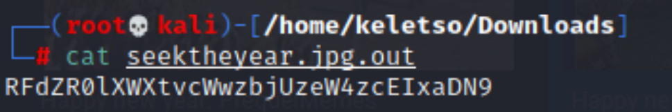

# FindTheYear Walkthrough

**Task Description:** Use steganography and encryption/ decryption tools to find the flag. 


## Step 1
Download the image

## Step 2
Use a steganography tool to try and locate any hidden information
The first steganography tool one might use is `steghide`. However, this image has been password protected meaning the attacker will have to use a technique that involves the use of a wordlist. 

## Step 3
The attacker may then try attempt to find the hidden file using stegcracker which uses the rockyou.txt wordlist to try crack the password encryption on the file. Upon running the stegcracker, the user may notice a prompt stating that stegcracker has been retired and replaced with stegseek which will blast through the rockyou.txt wordlist within a couple seconds.



## Step 4
After downloading stegseek, run the command on the downloaded image. When this has finished running, the hidden file will be extracted, and the passphrase used to encrypting the file will also be shown. 


## Step 5
Use the cat command to open the file and reveal the text. On inspection of the text, one might notice that the file is not in the format of the required flag meaning it has been encrypted.



**Output:** 
```
RFdZR0lXWXtvcWwzbjUzeW4zcEIxaDN9
```

## Step 6
The file has been base64 encoded so any base64 decoder can be used to decode the text.


**Output:** 
```
DWYGIWY{oql3n53yn3pB1h3}
```

## Step 7
The decoded text is still not in the required flag format. Looking at the output, it would appear the text has been rotated using some type of cipher. To find out how to get to decipher the text, you need to look at the original image and also the passphrase output. 
Upon looking at the image, if you are aware, you will know of cipher know as the **rotation** (ROT) cipher. To get rotation value, if you look at the name of the challenge ‘Seek the Year’, the encryption passphrase ‘seek2222’, and image referring to a new year, you can assume that rotation value is 22, for the upcoming new year 2022. 
Using an online ROT cipher decoder, you can find the flag, which is **HACKMAC{sup3r53cr3tF1l3}**.

**Output:** 
```
HACKMAC{sup3r53cr3tF1l3}
```