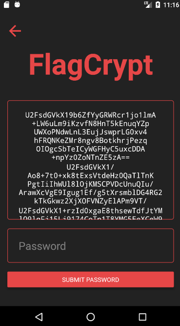

# Challenge Overview


This challenge is an introduction into both Android reverse engineering as well as React Native reverse engineering.

---

We are given an apk file `let_me_in.apk` and a prompt of 
> Well, what are you waiting for? The passwords right there!

Okay then, sounds straightforward enough right?
Let's try running the app and seeing what we have.

The easiest way to do this would probably be to install it on your own Android phone if you have one. However I highly recommend against doing this with any random file you download from the internet, especially from a CTF! Besides, most people probably won't have an Android phone available to them anyway.

So our next easiest option (and definitely the most flexible one) would be to set up an Android emulator in [Android Studio](https://developer.android.com/studio/) and then install the apk there.

You can watch a tutorial on how to set up an android emulator in Android Studio here https://www.youtube.com/watch?v=7KdGmg4mTpI.

Once that's done, we can start the emulator and drag and drop our apk to it to install it.

I generally go with a older version of android without the google play store capabilities installed. I think there are generally less protections involved with these (able to shell in as root via adb), and we don't need play store capabilities, so it's better to just use one without it.

Once we have installed and launched the app we are greated with this screen.


If we hit enter we get a pop up saying that we are not allowed in!


# Solution

Okay so the logical step we can take here is that there is some sort of check being performed when we hit the enter button. They've even given us the "password", so surely once we bypass the entry screen more functionality will be exposed to us.

Time to decompile the apk and see what we have inside.

To do this, my tool of choice is [apktool](https://ibotpeaches.github.io/Apktool/).
It makes decompiling apks as simple as 
```
apktool d let_me_in.apk
```

So once we've decompiled the apk we have the following directory structure.
```
let_me_in
├── AndroidManifest.xml
├── META-INF
├── apktool.yml
├── assets
├── kotlin
├── lib
├── original
├── res
├── smali
├── smali_classes2
└── unknown
```

A trick that we can use in order to find where the application code resides is to just search for a string that we know is present in the application. Let's use "You are not allowed in".

Grepping for this we get
```
❯ rg -i "you are not allowed in" let_me_in
let_me_in/assets/index.android.bundle
502: ... alert('You are not allowed in!') ...
```

So we know that some of the application code must be inside `let_me_in/assets/index.android.bundle`. Specifically the code that creates the alert when we try to enter is on line 502 and it looks like it's written in JavaScript! (This is a big clue that it is a React Native application, however that's not really too important anymore).

So let's open up `index.android.bundle` and check out line 502.

We can see that the alert is shown if `P` is false as well as the function `z` being called with `false`. So let's change `P` to `!P` and `!1` to `true` and see what happens.

```js
{z(!1),P||alert('You are not allowed in!')}
```

to
```js
{z(true),!P||alert('You are not allowed in!')}
```

# Recompiling

Now comes a bit of a tricky part.
If we try to just recompile our changes with `apktool b let_me_in` and install the resulting apk, we will receive a certificate error.


This because Android only allows the installation of apks that have been [signed with valid certificates](https://developer.android.com/studio/publish/app-signing.html).

Fortunately, this is easy to do with the help of uber-apk-signer. Just download the latest realease JAR from the [releases tab](https://github.com/patrickfav/uber-apk-signer/releases).

We can then sign our recompiled apk with
```
java -jar uber-apk-signer-1.2.1.jar --apks let_me_in.apk --out let_me_in_signed.apk
```

Now we can install this apk the same way we installed the original one. You might need to uninstall the original one first if you receive a `INSTALL_FAILED_UPDATE_INCOMPATIBLE` error.

After successfully installing our patched app and pressing enter. We are in!

We are presented with the following screen with what looks like encrypted messages appearing in the text box.



Let's try enter the password and see what we get the flag!


